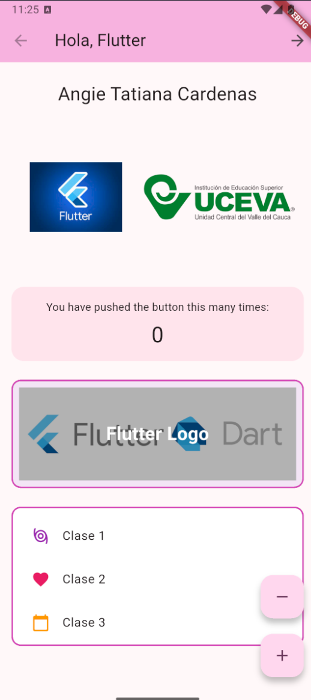
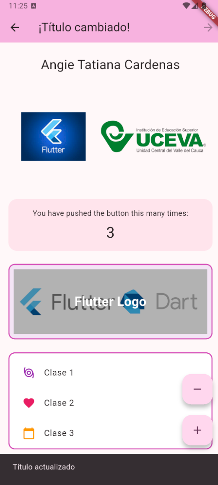

# Taller 1 - Flutter

Aplicacion Flutter desarrollada como parte del taller, que incluye:
- Cambio dinamico del titulo en la barra superior.
- Visualizacion de imagen desde URL y logo local con assets.
- Contador con botones de incremento y decremento.

## Datos del estudiante

- Nombre completo: Angie Tatiana Cardenas
- Codigo: 230221007

## Pasos para ejecutar

1. Abrir una terminal en la carpeta del proyecto:

```bash
cd taller1_app
```

2. Instalar dependencias:

```bash
flutter pub get
```

3. Ejecutar la aplicacion:

```bash
flutter run
```

## Capturas




